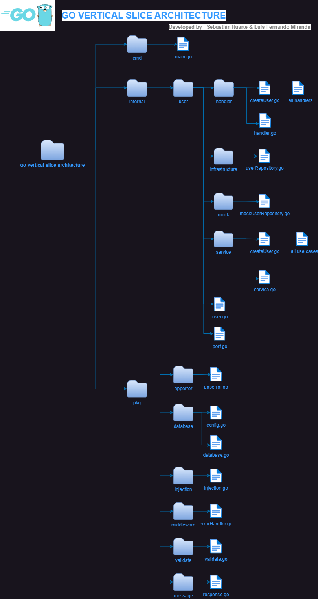
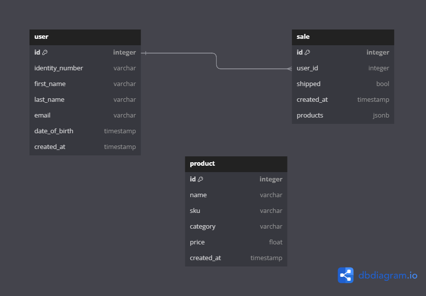
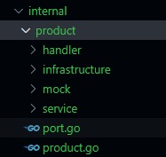

<h1 align='center'>
    ⚡ go-vertical-slice-architecture
</h1>

This structure, created following the development guide's for vertical slice architecture, will help to isolate the dependencies, make development easier and have a cleaner and testable code in every package.

## 👩‍💻 Authors

#### Sebastián Ituarte

- [@sebajax](https://www.github.com/sebajax)

#### Luis Fernando Miranda

- [@Abraxas-365](https://www.github.com/Abraxas-365)

## 🖍 Vertical slice architecture

Vertical slice architecture is an approach to software development where code and functionality are organized around individual features or user stories, encompassing all layers of the application from user interface to data access, promoting autonomy, reduced dependencies, and iterative development.


## 📚 Code Structure



A brief description of the layout:

- `.github` has two template files for creating PR and issue. Please see the files for more details.
- `.gitignore` varies per project, but all projects need to ignore `bin` directory.
- `.golangci.yml` is the golangci-lint config file.
- `Makefile` is used to build the project. **You need to tweak the variables based on your project**.
- `CHANGELOG.md` contains auto-generated changelog information.
- `OWNERS` contains owners of the project.
- `README.md` is a detailed description of the project.
- `cmd` contains the main.go file that is our starting point to execute
- `pkg` places most of project business logic.
- `migrations` contains all vendored code.
- `internal` contains all the api logic.

## 🚀 Stack


### Programming language

- [Go](https://go.dev/)

### Framework

- [Fiber](https://docs.gofiber.io/)

### Dependency injection

- [Uber dig](https://github.com/uber-go/dig)

### Database

- [Postgre SQL](https://www.postgresql.org/)

### Container

- [Docker](https://www.docker.com/)

### Live reload

- [Air](https://github.com/cosmtrek/air)

## 🧐 This app uses conventional commits

[Conventional commits url](https://www.conventionalcommits.org/en/v1.0.0/)

## 🤜 How to create a new use case (Example)

### Database diagram for the project



### Internal folder structure for a new domain



### 1 - Create product.go (domain)

https://github.com/sebajax/go-vertical-slice-architecture/blob/d4501917930ef2263551bee3ee529de49b6d6fc5/internal/product/product.go#L1-L58

## ⚙️ Usage

### Docker usage

```bash
    # Build server
        docker-compose -p go-vertical-slice-architecture build

    # Start server
        docker-compose up -d

    # Stop server
        docker-compose down
```

### Standalone usage

```bash
    # Live reload
        air
```

### Testing

```bash
    # To run unit testing
        go test

    # To run unit testing coverage
        go test -cover ./...
```

### Formatting, Linting and Vetting

```bash
    # Run formating
        go fmt ./...

    # Remove unused imports
        goimports -l -w .

    # Run linting
        golangci-lint run ./...

    # Run vetting
        go vet ./...

    # Run shadow to check shadowed variables
        # Install shadow
        go install golang.org/x/tools/go/analysis/passes/shadow/cmd/shadow@latest
        # Run shadow
        shadow ./...
```

### Database migration script

```bash
    # Create the script
        migrate create -ext sql -dir /migrations -seq [script_name]
    # Run the script
        migrate -database ${POSTGRESQL_URL} -path /migrations up

    # It will run automatically when the database initializes
```

## 💻 Environment variables

To modify/add configuration via environment variables, use the `.env` file, which contains basic app configuration.
