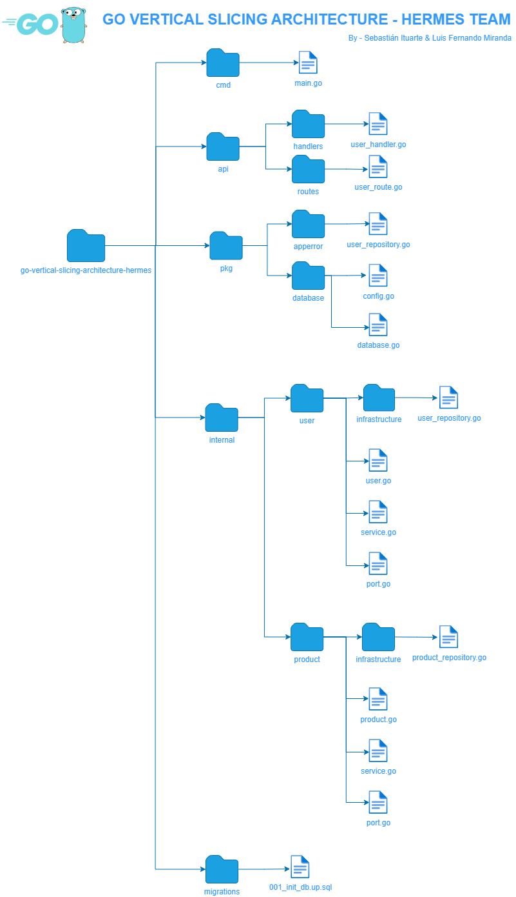

## go-vertical-slice-architecture

#### Developed by Sebastián Ituarte & Luis Fernando Miranda

[@sebajax] (https://github.com/sebajax) (Sebastián Ituarte)

[@Abraxas-365] (https://github.com/Abraxas-365) (Luis Fernando Miranda)

#### This structure, created following the development guide's for vertical slice architecture, will help to isolate the dependencies, make development easier and have a cleaner and testable code in every package.

#### Programming language: Golang

#### Framework used: Fiber

https://github.com/gofiber/fiber

#### Dependency Injection: Dig

https://github.com/uber-go/dig

### This app uses conventional commits

[Conventional commits url](https://www.conventionalcommits.org/en/v1.0.0/)

### structure

    cmd
        contains the main.go file that is our starting point to execute
    migrations
        contains all the database configuration for the api (if needed)
    internal
        contains all the api logic

### Docker usage

    Build server
        docker-compose -p go-vertical-slice-architecture build

    Start server
        docker-compose up -d

    Stop server
        docker-compose down

### Standalone usage

    air

### Testing

    To run unit testing

    To run unit testing coverage

### Database migration script

    To run the script

### Environment variables

To modify/add configuration via environment variables, use the `.env` file, which contains basic app configuration.
