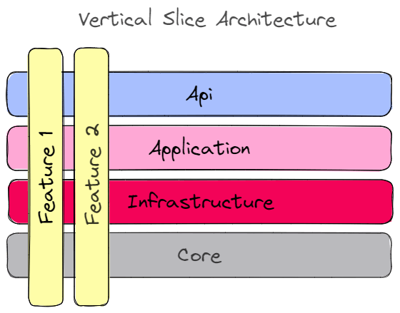
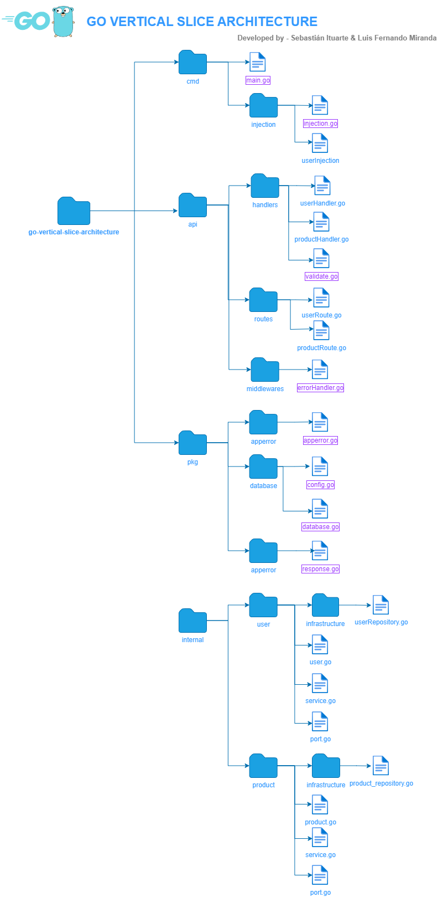

<h1 align='center'>
    ⚡ go-vertical-slice-architecture
</h1>

This structure, created following the development guide's for vertical slice architecture, will help to isolate the dependencies, make development easier and have a cleaner and testable code in every package.

## 👩‍💻 Authors

#### Sebastián Ituarte

- [@sebajax](https://www.github.com/sebajax)

#### Luis Fernando Miranda

- [@Abraxas-365](https://www.github.com/Abraxas-365)

## 🖍 Vertical slice architecture

Vertical slice architecture is an approach to software development where code and functionality are organized around individual features or user stories, encompassing all layers of the application from user interface to data access, promoting autonomy, reduced dependencies, and iterative development.

## 📚 Code Structure

    cmd
        contains the main.go file that is our starting point to execute
    migrations
        contains all the database configuration for the api (if needed)
    internal
        contains all the api logic

## 🚀 Stack

### Programming language

- [Go](https://go.dev/)

### Framework

- [Fiber](https://docs.gofiber.io/)

### Dependency injection

- [Uber dig](https://github.com/uber-go/dig)

### Database

- [Postgre SQL](https://www.postgresql.org/)

### Container

- [Docker](https://www.docker.com/)

### Live reload

- [Air](https://github.com/cosmtrek/air)

## 🧐 This app uses conventional commits

[Conventional commits url](https://www.conventionalcommits.org/en/v1.0.0/)

## 🤜 How to create a new use case (Example)

### Database diagram for the project

## ⚙️ Usage

### Docker usage

    Build server
        docker-compose -p go-vertical-slice-architecture build

    Start server
        docker-compose up -d

    Stop server
        docker-compose down

### Standalone usage

    air

### Testing

    To run unit testing
        go test

    To run unit testing coverage
        go test -cover ./...

### Formatting, Linting and Vetting

    To run formating
        go fmt ./...

    To remove unused imports
        goimports -l -w .

    To run linting
        golangci-lint run ./...

    To run vetting
        go vet ./...

### Database migration script

    To create the script
        migrate create -ext sql -dir /migrations -seq [script_name]
    To run the script
        migrate -database ${POSTGRESQL_URL} -path /migrations up

    * It will run automatically when the database initializes

## 💻 Environment variables

To modify/add configuration via environment variables, use the `.env` file, which contains basic app configuration.
